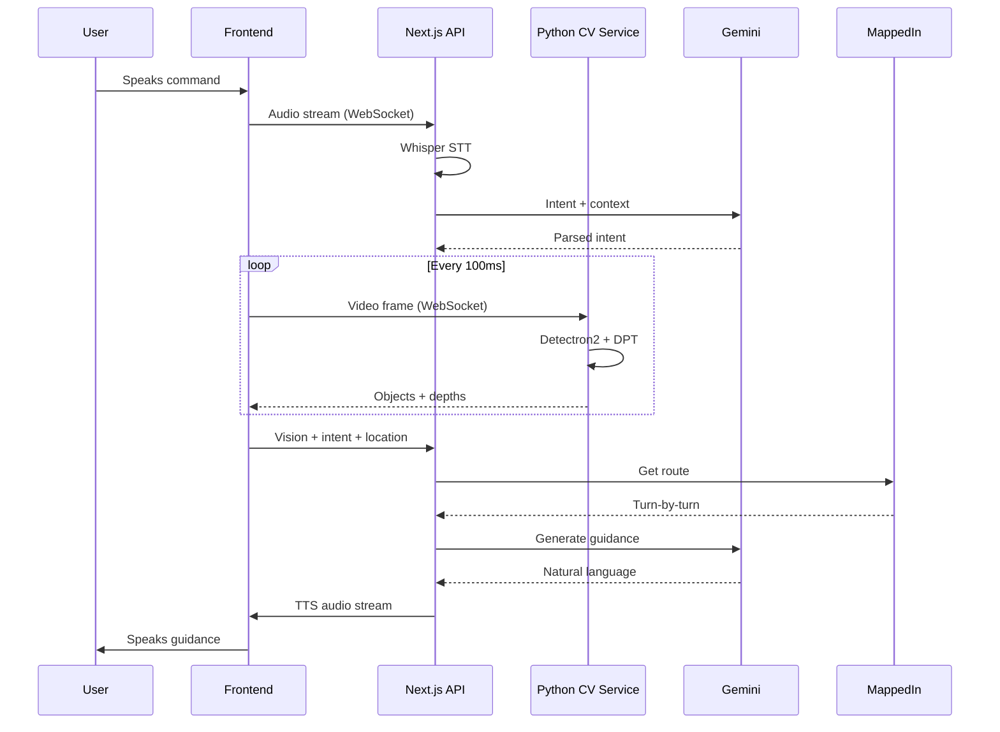

# Voice-Controlled Indoor Navigation Companion

A multimodal AI assistant for visually impaired users providing real-time indoor navigation through voice interaction, computer vision, and spatial awareness.

---

## 🚀 Pre-Implementation Setup (Outside IDE)

### 1. API Keys & Accounts Required

| Service | Purpose | Action |
|---------|---------|--------|
| **Clerk** | Authentication | ✅ Already configured |
| **Supabase** | Real-time state sync | ✅ Already configured |
| **ElevenLabs** | Conversational AI + TTS | [Sign up](https://elevenlabs.io) → Get API key |
| **OpenAI/Whisper** | Speech-to-text | [Sign up](https://platform.openai.com) → Get API key |
| **Google Gemini** | Scene reasoning | [Get API key](https://makersuite.google.com/app/apikey) |
| **Cohere** | Rerank API | [Sign up](https://cohere.com) → Get API key |
| **MappedIn** | Indoor mapping SDK | [Contact sales](https://www.mappedin.com) → Get SDK credentials |

### 2. Python Environment Setup

```bash
# Create virtual environment for CV microservices
cd backend
python -m venv venv
venv\Scripts\activate  # Windows

# Install core CV dependencies
pip install torch torchvision detectron2 transformers opencv-python fastapi uvicorn websockets
pip install openai-whisper librosa numpy pillow
```

### 3. Frontend Dependencies to Install

```bash
cd frontend
npm install socket.io-client @clerk/nextjs @supabase/supabase-js
npm install elevenlabs  # ElevenLabs SDK
npm install @google/generative-ai  # Gemini SDK
npm install cohere-ai  # Cohere SDK
```

### 4. MappedIn SDK Setup

1. Register at [MappedIn Developer Portal](https://developer.mappedin.com)
2. Create a venue/building map or request demo venue access
3. Obtain: `clientId`, `clientSecret`, `venueId`

---

## 📂 Project Architecture

```
cxc/
├── frontend/                          # Next.js 16 App Router
│   ├── app/
│   │   ├── (auth)/                    # Existing auth routes (Clerk)
│   │   ├── (dashboard)/               # Existing dashboard
│   │   ├── (navigation)/              # NEW: Navigation experience
│   │   │   ├── layout.tsx             # Full-screen accessible layout
│   │   │   └── page.tsx               # Main navigation interface
│   │   ├── api/
│   │   │   ├── speech/transcribe/     # Whisper STT endpoint
│   │   │   ├── vision/analyze/        # Proxy to Python CV service
│   │   │   └── ai/reason/             # Gemini scene reasoning
│   │   └── globals.css
│   │
│   ├── components/
│   │   ├── navigation/
│   │   │   ├── VoiceListener.tsx      # Mic capture + STT
│   │   │   ├── VoiceSpeaker.tsx       # TTS playback
│   │   │   └── CameraStream.tsx       # Live video feed
│   │   └── mappedin/
│   │       └── IndoorMap.tsx          # MappedIn SDK wrapper
│   │
│   ├── lib/
│   │   ├── websocket.ts               # WebSocket client logic
│   │   ├── audio-utils.ts             # Web Audio API helpers
│   │   └── spatial-audio.ts           # Left/right audio cues
│   │
│   └── hooks/
│       ├── useVoiceInput.ts           # Continuous speech capture
│       └── useCameraStream.ts         # MediaDevices API
│
├── backend/                           # Python CV Microservices (FastAPI)
│   ├── main.py                        # Server & WebSocket orchestration
│   ├── services/
│   │   ├── detection.py               # Detectron2 object detection
│   │   └── depth.py                   # DPT depth estimation
│   └── utils/
│       └── spatial.py                 # Distance & spatial safety logic
```

---

## 🔄 WebSocket Message Flow



---

## 🔑 Environment Variables (.env.local)

```env
# Existing
NEXT_PUBLIC_SUPABASE_URL=...
NEXT_PUBLIC_SUPABASE_ANON_KEY=...
NEXT_PUBLIC_CLERK_PUBLISHABLE_KEY=...
CLERK_SECRET_KEY=...

# New - AI & Navigation
ELEVENLABS_API_KEY=...
OPENAI_API_KEY=...
GOOGLE_GEMINI_API_KEY=...
COHERE_API_KEY=...
MAPPEDIN_CLIENT_ID=...
MAPPEDIN_CLIENT_SECRET=...
MAPPEDIN_VENUE_ID=...
PYTHON_CV_SERVICE_URL=http://localhost:8000
```

---

## 🛠 Implementation Path

### Phase 1: Audio Core
- Microphone capture with Web Audio API
- Real-time transcription (Whisper)
- Neural TTS delivery (ElevenLabs)

### Phase 2: Spatial Vision
- Live camera stream to Python backend
- Detectron2 for object identification
- Depth estimation (DPT) for obstacle avoidance

### Phase 3: Indoor Mapping
- MappedIn routing integration
- Fusion of vision data with floor plans
- Landmark-based voice guidance

### Phase 4: Intelligence Layer
- Gemini-powered scene reasoning
- Cohere Rerank for alert prioritization
- Emergency interrupt handlers

---

## ⚠️ Critical Reminders

> [!IMPORTANT]
> **GPU Requirement**: Real-time object detection and depth estimation require a CUDA-capable GPU. CPU-only execution will result in high latency.

> [!WARNING]
> **Accessible UI**: Since this is for visually impaired users, prioritize Screen Reader support (ARIA labels) and native Haptic feedback where possible.
