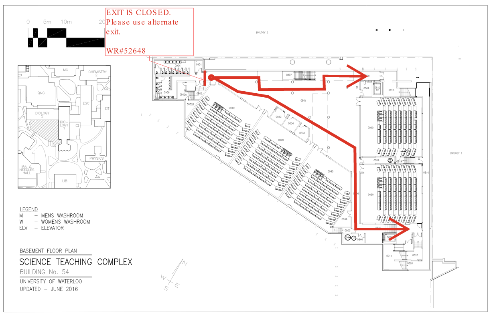

# DWS -- Digital Walking Stick

**AI-powered indoor navigation for visually impaired users.**

DWS is a voice-first indoor navigation assistant that combines real-time computer vision, monocular depth estimation, multimodal AI reasoning, and text-to-speech to guide users through indoor environments using nothing but a smartphone camera. No beacons. No pre-installed hardware. Just a phone pointed forward and an AI that sees, understands, and speaks.

---

## Table of Contents

- [What It Does](#what-it-does)
- [System Architecture](#system-architecture)
- [How It Works (Technical Deep Dive)](#how-it-works-technical-deep-dive)
- [Floor Plan](#floor-plan)
- [Project Structure](#project-structure)
- [Getting Started](#getting-started)
- [Environment Variables](#environment-variables)
- [Tech Stack](#tech-stack)
- [License](#license)

---

## What It Does

1. **Voice Navigation** -- Say "I'm in room 0020, take me to room 0010" and DWS plots the shortest path using Dijkstra's algorithm over a graph extracted from the building floor plan.

2. **Continuous 3-Second Guidance** -- Once navigating, DWS automatically captures a camera frame every 3 seconds, runs object detection + depth estimation + AI scene reasoning, and speaks a step-based instruction through ElevenLabs TTS: "Go 3 steps forward", "Chair 2 steps ahead, take 2 steps to your left."

3. **Braille Detection** -- A trained YOLO model detects braille signage on walls and doors and reads it aloud: "I also detected braille text that reads: Room 0010."

4. **Live Map Tracking** -- An SVG-based floor plan shows the user's position, traversed path, remaining route, direction arrow, and progress percentage in real time.

5. **Zero Infrastructure** -- Upload a floor plan SVG and Gemini 2.0 Flash Vision analyzes it once to extract rooms, hallway waypoints, and connections. The navigation graph builds automatically.

---

## System Architecture

```
Phone Camera --> WebSocket --> FastAPI Backend --> YOLOv8 + MiDaS + Gemini --> ElevenLabs TTS --> Speaker
```


The system is split into two tiers:

**Client tier** -- A Next.js 16 frontend (React 19, TypeScript) running on the user's phone. Captures camera frames, sends them over WebSocket, receives processed frames and detections, and plays voice instructions through ElevenLabs or browser TTS.

**Server tier** -- A Python FastAPI async backend running all ML inference. Receives base64-encoded JPEG frames, runs object detection (YOLOv8n), depth estimation (MiDaS Small), obstacle classification, multimodal scene reasoning (Gemini 2.0 Flash), braille detection, and pathfinding (Dijkstra). Returns annotated frames, detection data, navigation instructions, and generates MP3 audio via ElevenLabs.

### Data Flow

1. The phone camera captures frames at 640x480, which the `CameraStream` component downscales to **240px width at 35-40% JPEG quality** and sends as base64 over WebSocket.
2. A **backpressure system** ensures no frame is sent until the server responds to the previous one. An **adaptive rate controller** measures round-trip time and adjusts the send interval (80-800ms), achieving 5-12 FPS.
3. The backend **drains the WebSocket queue** on each receive, keeping only the freshest frame and discarding stale ones.
4. **YOLOv8n** runs detection on every frame (~30-50ms, offloaded to a thread pool).
5. **MiDaS Small** runs depth estimation on a **1.5-second time-based cooldown**. Between runs, the cached depth map is reused for per-bbox distance lookups (<1ms each).
6. The **ObstacleClassifier** computes bounding-box overlap with the walking corridor (center 40% of the frame) and applies distance-tiered blocking thresholds: 25% coverage at <1m, 35% at 1-2m, 50% at 2-3.5m. It determines the clear side (left or right) and converts distances to walking steps (1 step = ~0.75m).
7. **Gemini 2.0 Flash** receives the raw image + structured detection data and generates a concise, step-based verbal command under 20 words. Falls back to rule-based instruction generation on timeout.
8. Every 3 seconds during navigation, the frontend captures a high-quality frame and calls the `/analyze-and-announce` endpoint, which runs Gemini reasoning and braille detection **in parallel** using `asyncio.gather`. The announcement is sent to ElevenLabs for MP3 synthesis, streamed back, and played. If ElevenLabs fails, browser `SpeechSynthesis` is used as a fallback.
9. **Overlap protection** at every level: the auto-announce cycle skips if the system is still speaking or a previous analysis is in-flight.

### Pathfinding Pipeline

1. On server startup, Gemini 2.0 Flash Vision analyzes the floor plan SVG (rendered to PNG) and extracts room numbers, door coordinates, hallway intersections, and connectivity as structured JSON.
2. The result is cached to `basement_analysis.json` (one-time expensive operation).
3. A weighted adjacency list graph is built from the analysis (~23 rooms, ~34 hallway waypoints, ~73 edges).
4. When the user requests navigation, their voice command is parsed (regex fast-path, Gemini LLM fallback), rooms are resolved with normalization ("0020" / "020" / "20"), and Dijkstra's algorithm returns the shortest path as ordered `{x, y, label}` waypoints.

---

## Floor Plan

DWS was built and tested on the **Science Teaching Complex (Building 54) basement** at the University of Waterloo.



The floor plan SVG is analyzed once by Gemini Vision to produce a navigation graph. The graph supports pathfinding between all rooms in the basement.

---

## Project Structure

```
dws/
|-- backend/                          # Python FastAPI server
|   |-- main.py                       # FastAPI app, endpoints, WebSocket handlers
|   |-- requirements.txt              # Python dependencies
|   |-- yolov8n.pt                    # YOLOv8 nano model weights
|   |-- services/
|   |   |-- detection.py              # YOLOv8 object detection service
|   |   |-- depth.py                  # MiDaS monocular depth estimation
|   |   |-- reasoning.py              # Obstacle classification + Gemini reasoning
|   |   |-- pathfinding.py            # Dijkstra shortest path algorithm
|   |   |-- map_analyzer.py           # Gemini Vision floor plan analysis
|   |   |-- braille.py                # Braille sign detection and reading
|   |   |-- tts.py                    # ElevenLabs text-to-speech service
|   |   |-- whisper_stt.py            # Speech-to-text (Whisper)
|   |   |-- frame_processor.py        # Frame processing utilities
|   |-- static/
|   |   |-- camera_test.html          # Standalone mobile camera client
|   |   |-- floor_plans/
|   |       |-- basement.svg          # Source floor plan (SVG)
|   |       |-- basement.png          # Rendered floor plan (PNG)
|   |       |-- basement_analysis.json # Cached Gemini analysis
|   |-- utils/
|       |-- spatial.py                # Spatial utilities
|
|-- frontend/                         # Next.js 16 application
|   |-- app/
|   |   |-- page.tsx                  # Landing page
|   |   |-- layout.tsx                # Root layout (ClerkProvider)
|   |   |-- globals.css               # Global styles
|   |   |-- navigate/
|   |   |   |-- page.tsx              # Main navigation interface
|   |   |   |-- layout.tsx            # Navigation layout
|   |   |-- (auth)/
|   |   |   |-- signIn/               # Clerk sign-in page
|   |   |   |-- signUp/               # Clerk sign-up page
|   |   |-- (dashboard)/
|   |   |   |-- dashboard/page.tsx    # User dashboard
|   |   |-- api/
|   |       |-- ai/reason/route.ts    # AI reasoning API route
|   |       |-- webhooks/clerk/       # Clerk webhook handler
|   |-- components/
|   |   |-- navigation/
|   |   |   |-- CameraStream.tsx      # WebSocket camera stream with backpressure
|   |   |   |-- FloorPlanMap.tsx      # SVG floor plan with live tracking
|   |   |   |-- VoiceSpeaker.tsx      # ElevenLabs TTS playback + fallback
|   |   |   |-- CameraViewer.tsx      # Dashboard camera viewer
|   |   |   |-- HapticFeedback.tsx    # Haptic feedback component
|   |   |   |-- VoiceListener.tsx     # Voice input component
|   |   |-- ui/
|   |       |-- navbar.tsx            # Navigation bar
|   |-- hooks/
|   |   |-- useNavigation.ts          # Navigation state hook
|   |   |-- useHaptics.ts             # Haptic feedback hook
|   |   |-- useVoiceInput.ts          # Voice input hook
|   |   |-- useCameraStream.ts        # Camera stream hook
|   |-- lib/
|   |   |-- elevenlabs.ts             # ElevenLabs client setup
|   |   |-- spatial-audio.ts          # Spatial audio processing
|   |   |-- supabase/                 # Supabase client/server
|   |-- middleware.ts                  # Clerk auth middleware + redirects
|   |-- types/
|       |-- navigation.ts             # TypeScript type definitions
|
|-- docs/
|   |-- system-architecture.png       # Architecture diagram
|-- LICENSE
|-- README.md
```

---

## Getting Started

### Prerequisites

- Python 3.10+
- Node.js 18+
- npm or yarn
- A Google Gemini API key
- An ElevenLabs API key
- A Clerk account (for authentication)

### 1. Clone the repository

```bash
git clone https://github.com/your-username/dws.git
cd dws
```

### 2. Backend setup

```bash
cd backend

# Create a virtual environment
python -m venv venv

# Activate it
# Windows:
venv\Scripts\activate
# macOS/Linux:
source venv/bin/activate

# Install dependencies
pip install -r requirements.txt

# Create .env file
cp .env.example .env
# Edit .env and add your API keys (see Environment Variables below)
```

Start the backend server:

```bash
python main.py
```

The server starts on `http://0.0.0.0:8000`. For phone access, use your computer's local IP address (e.g. `http://192.168.x.x:8000`).

### 3. Frontend setup

```bash
cd frontend

# Install dependencies
npm install

# Create .env.local file
cp .env.local.example .env.local
# Edit .env.local and add your keys (see Environment Variables below)
```

Start the development server:

```bash
npm run dev
```

The frontend starts on `http://localhost:3000`.

### 4. Mobile client (standalone)

For quick phone testing without the Next.js frontend, open the standalone camera client directly:

```
http://<your-ip>:8000/static/camera_test.html
```

This is a self-contained HTML page served by the FastAPI backend that includes the full camera stream, navigation, and voice UI.

---

## Environment Variables

### Backend (`backend/.env`)

```env
# Google Gemini API Key (required -- scene reasoning, floor plan analysis)
GOOGLE_GEMINI_API_KEY=your_gemini_api_key

# ElevenLabs API Key (required -- voice announcements)
ELEVENLABS_API_KEY=your_elevenlabs_api_key

# Server port (default: 8000)
PORT=8000
```

### Frontend (`frontend/.env.local`)

```env
# Clerk Authentication
NEXT_PUBLIC_CLERK_PUBLISHABLE_KEY=your_clerk_publishable_key
CLERK_SECRET_KEY=your_clerk_secret_key
NEXT_PUBLIC_CLERK_SIGN_IN_URL=/signIn
NEXT_PUBLIC_CLERK_SIGN_UP_URL=/signUp
NEXT_PUBLIC_CLERK_AFTER_SIGN_IN_URL=/dashboard
NEXT_PUBLIC_CLERK_AFTER_SIGN_UP_URL=/dashboard

# Supabase (data persistence)
NEXT_PUBLIC_SUPABASE_URL=your_supabase_url
NEXT_PUBLIC_SUPABASE_ANON_KEY=your_supabase_anon_key

# ElevenLabs (client-side)
ELEVENLABS_API_KEY=your_elevenlabs_api_key

# Google Gemini (client-side)
NEXT_PUBLIC_GEMINI_API_KEY=your_gemini_api_key
```

---

## Tech Stack

| Layer | Technology | Purpose |
|---|---|---|
| Frontend | Next.js 16, React 19, TypeScript | App framework, UI rendering |
| Styling | Tailwind CSS 4 | Utility-first styling |
| Auth | Clerk | User authentication, protected routes |
| Database | Supabase | Data persistence |
| Backend | FastAPI, Uvicorn | Async Python API server |
| Object Detection | YOLOv8n (Ultralytics) | Real-time object detection (30-50ms) |
| Depth Estimation | MiDaS Small (Intel ISL, PyTorch) | Monocular depth-to-distance conversion |
| Scene Reasoning | Gemini 2.0 Flash (Google) | Multimodal image + text analysis |
| Floor Plan Analysis | Gemini 2.0 Flash Vision | SVG-to-navigation-graph extraction |
| Pathfinding | Dijkstra's Algorithm | Shortest path computation |
| Braille Detection | YOLO (trained model) | Braille sign detection and reading |
| Text-to-Speech | ElevenLabs (`eleven_flash_v2_5`) | Natural voice synthesis (MP3, 44.1kHz) |
| Speech-to-Text | Web Speech API | Browser-native voice commands |
| Real-time Comms | WebSockets | Camera frame streaming |
| Image Processing | OpenCV, Pillow, NumPy | Frame decoding, annotation, encoding |

---

## API Endpoints

| Method | Endpoint | Description |
|---|---|---|
| GET | `/health` | Server health check |
| POST | `/detect` | Detect objects in an uploaded image |
| POST | `/announce` | Generate ElevenLabs voice audio from text |
| POST | `/navigate` | Parse voice command and return shortest path |
| POST | `/analyze-and-announce` | Full pipeline: detect + depth + reason + braille |
| GET | `/rooms` | List all known rooms |
| POST | `/reanalyze-map` | Force re-analysis of the floor plan |
| WS | `/ws/video` | Real-time camera frame processing |
| WS | `/ws/viewer` | Dashboard viewer (receive-only broadcast) |

---

## Performance

| Stage | Latency | Optimization |
|---|---|---|
| Frame capture + encode | ~5ms | 240px width, JPEG 35% quality |
| WebSocket transit | ~10ms | Base64, stale frame draining |
| YOLOv8n detection | 30-50ms | Every frame, thread pool offload |
| MiDaS depth | ~80ms | 1.5s cooldown, cached depth map reuse |
| Gemini reasoning | 1-3s | Parallel with braille, 2 retries, 12s timeout |
| ElevenLabs TTS | 0.5-2s | Streamed MP3, browser fallback |
| **Full announce cycle** | **~3s** | **Auto-fires every 3 seconds during navigation** |

---

## License

See [LICENSE](LICENSE) for details.
